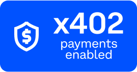

# x402-dotnet

  
**x402 Payment Protocol implementation for .Net**  
More info about x402: https://www.x402.org

Install the `x402` packages from NuGet:
- [x402](https://nuget.org/packages/x402)
- [x402.Coinbase](https://nuget.org/packages/x402)


**Features:**
- Add an x402-compatible paywall to any URL  
- Easily use an attribute to handle payments for your API methods  
- Add URLs that require payment using the middleware  
- Support advanced scenarios by calling the `X402Handler` in your API controller  
- Handle payment settlement using any remote facilitator  
- Optionally use the Coinbase facilitator (with API key)


## How to use?

Setup the Facilitator in Program.cs
```cs
// Add the facilitator in Program.cs
builder.Services.AddHttpClient<IFacilitatorClient, HttpFacilitatorClient>(client =>
{
    client.BaseAddress = new Uri("https://localhost:7141"); // Address of your facilitator
});
```

Use the `PaymentRequired` Attribute
```cs
// Use the Payment Required Attribute
[HttpGet]
[Route("protected")]
[PaymentRequired("1000", "0x036CbD53842c5426634e7929541eC2318f3dCF7e", "0xYourAddressHere", "base-sepolia")]
public SampleResult Protected()
{
    return new SampleResult { Title = "Protected by PaymentRequired Attribute" };
}

```
Directly in an API Controller
```cs
[HttpGet]
[Route("dynamic")]
public async Task<SampleResult?> Dynamic(string amount)
{
    var request = this.HttpContext.Request;
    var fullUrl = $"{request.Scheme}://{request.Host}{request.Path}{request.QueryString}";

    var x402Result = await X402Handler.HandleX402Async(this.HttpContext, facilitator, fullUrl,
        new Models.PaymentRequirements
        {
            Asset = "0x036CbD53842c5426634e7929541eC2318f3dCF7e", //USDC on base-sepolia
            Description = "Dynamic payment",
            Network = "base-sepolia",
            MaxAmountRequired = amount,
            PayTo = "0xYourAddress",
            Resource = fullUrl,
        });

    if (!x402Result.CanContinueRequest)
    {
        return null; // Response already written by HandleX402Async, so just exit
    }

    //Continue with the request
}
```


Or use the `PaymentMiddleware` to require payment for a list of URLs
```cs
// Add Middleware
var facilitator = app.Services.GetRequiredService<IFacilitatorClient>();
var paymentOptions = new x402.Models.PaymentMiddlewareOptions
{
    Facilitator = facilitator,
    DefaultPayToAddress = "0xYourWalletAddressHere", // Replace with your actual wallet address
    DefaultNetwork = "base-sepolia",
    PaymentRequirements = new Dictionary<string, x402.Models.PaymentRequirementsConfig>()
        {
            {  "/url-to-pay-for", new x402.Models.PaymentRequirementsConfig
                {
                    Scheme = x402.Enums.PaymentScheme.Exact,
                    MaxAmountRequired = 1000000,
                    Asset = "0x036CbD53842c5426634e7929541eC2318f3dCF7e", // Contract address of asset
                    MimeType = "application/json"
                }
            }
        },
};

app.UsePaymentMiddleware(paymentOptions);

```

## Coinbase Facilitator
To use the Coinbase Facilitator, install [x402.Coinbase](https://nuget.org/packages/x402.Coinbase)

```cs
// Add the Coinbase Config and Facilitator
builder.Services.Configure<CoinbaseOptions>(builder.Configuration.GetSection(nameof(CoinbaseOptions)));
builder.Services.AddHttpClient<IFacilitatorClient, CoinbaseFacilitatorClient>();
```

Add to appsettings.json:
```json
 "CoinbaseOptions": {
   "ApiKeyId": "YOUR_COINBASE_API_KEY_ID",
   "ApiKeySecret": "YOUR_COINBASE_API_KEY_SECRET"
 }
```

## How to test?
Follow these steps to test a x402 payment on the sample website hosted on Azure:
- Get some `USDC` tokens on the `base-sepolia` network from the [Coinbase Faucet](https://faucet.circle.com/)
- Use the x402 Debug Tool: https://proxy402.com/fetch
- Enter an API endpoint from the [test website](https://x402-dotnet.azurewebsites.net/), for example: `https://x402-dotnet.azurewebsites.net/resource/middleware`
- Connect your wallet
- Click Pay
- Payment will complete and show the result: `Protected by middleware`


## Facilitators
List of facilitators you can use:
- https://api.cdp.coinbase.com/platform/v2/x402/ (Coinbase, requires API key)
- https://facilitator.payai.network
- https://facilitator.mogami.tech/
- https://facilitator.mcpay.tech (Proxy Facilitator)


## Development
There is a sample website and mock Settlement server included.  
- Start the Aspire project: `x402-dotnet.AppHost`
- Navigate to the sample website `https://localhost:7154/`
- Use `x402.SampleWeb.http` for sample web requests

## Contributions
Contributions are welcome. Fork this repository and send a pull request if you have something useful to add.


## Links
Useful tools when developing x402 solutions:
- https://proxy402.com/fetch
- Specifications: https://github.com/coinbase/x402/blob/main/specs/x402-specification.md

